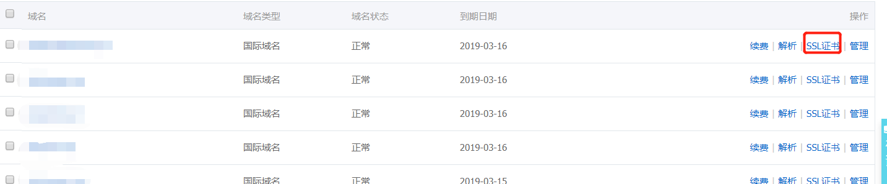
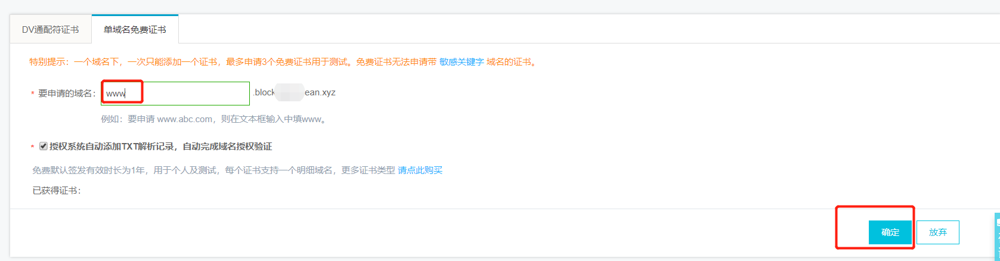
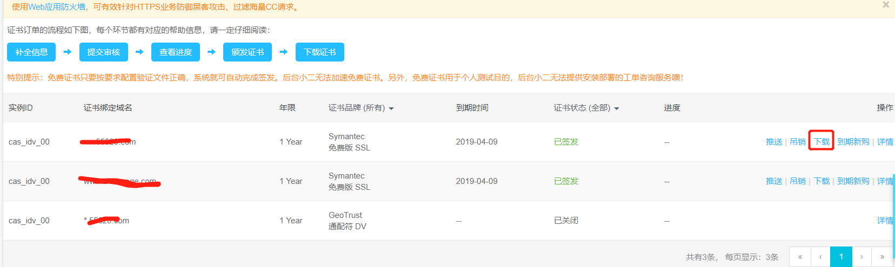
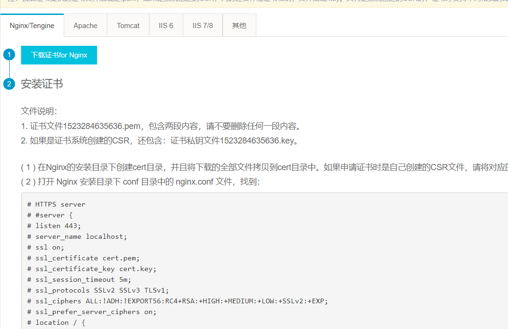

1. ## 打开控制台


2. ## 打开申请SSL申请界面


3. ## 下载SSL

  * ### 打开 安全（云盾）- CA证书
  

  * ### 配置Nginx
    阿里很细心，把各种WEB服务器配置SSL就去，有例举，拿来便事
    
    ```
    server {
        listen 443;
        server_name localhost;
        ssl on;
        root html;
        index index.html index.htm;
        ssl_certificate   cert/1523284635636.pem;
        ssl_certificate_key  cert/1523284635636.key;
        ssl_session_timeout 5m;
        ssl_ciphers ECDHE-RSA-AES128-GCM-SHA256:ECDHE:ECDH:AES:HIGH:!NULL:!aNULL:!MD5:!ADH:!RC4;
        ssl_protocols TLSv1 TLSv1.1 TLSv1.2;
        ssl_prefer_server_ciphers on;
        location / {
            root html;
            index index.html index.htm;
        }
   }
  ```
